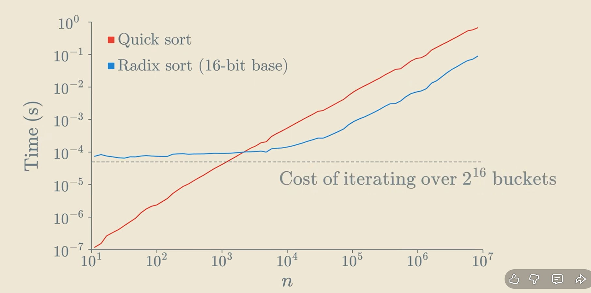
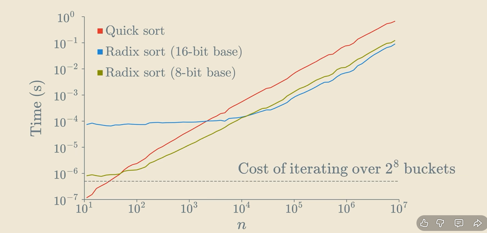

# Push-Swap Project

## Overview

**Push-Swap** is a sorting algorithm project where you are given:

- A **stack `a`** containing integers
- An empty **stack `b`**
- A limited set of **instructions** (`pa`, `pb`, `sa`, `sb`, `ra`, `rra`, etc.)

The goal is to **sort stack `a` in ascending order** using the **fewest possible instructions**.

---

## Instructions & Visualization

All instructions operate on the **top of the stacks**.  
Stacks are drawn with **top at the top**.

### `pa` — Push from `b` to `a`

Move the top element of `b` onto `a`.

**Before:**

a: 1 2 3
b: 4 5

**Command:** `pa`

**After:**

a: 4 1 2 3
b: 5

---

### `pb` — Push from `a` to `b`

Move the top element of `a` onto `b`.

**Before:**

a: 1 2 3
b: empty

**Command:** `pb`

**After:**

a: 2 3
b: 1

---

### `sa` / `sb` — Swap top 2 elements

Swap the first two elements of a stack.

**Before `sa`:** `a: 2 1 3`  
**After:** `a: 1 2 3`

**Before `sb`:** `b: 5 4`  
**After:** `b: 4 5`

`ss` swaps both stacks simultaneously.

---

### `ra` / `rb` — Rotate up

Top element moves to the bottom.  
`rr` rotates both stacks.

**Before `ra`:** `a: 1 2 3 4`  
**After:** `a: 2 3 4 1`

---

### `rra` / `rrb` — Reverse rotate

Bottom element moves to the top.  
`rrr` reverse rotates both stacks.

**Before `rra`:** `a: 1 2 3 4`  
**After:** `a: 4 1 2 3`

---

## Algorithm Choice by Stack Size

Choosing the right algorithm reduces the **number of instructions**:

| Stack Size | Algorithm Choice                                      | Reason                                                          |
| ---------- | ----------------------------------------------------- | --------------------------------------------------------------- |
| 2          | `sa` (swap if needed)                                 | Only 1 comparison required                                      |
| 3          | Hard-coded logic                                      | 3 elements can be sorted optimally with 2 moves max             |
| 4–5        | Push smallest elements to `b`, sort remaining 3, `pa` | More efficient than radix for small stacks                      |
| ≥6         | Radix sort                                            | Scales efficiently with `pb`, `pa`, `ra`; O(n log n) complexity |

---

### Why Not Radix for Small Stacks?

- **Extra moves for small stacks:** e.g., 3 numbers → radix may need ~12 moves
- **Hard-coded logic** solves it in 2 moves ✅
- **Goal:** Use the **minimum instructions possible**

---

### Maximum Theoretical Operations

| Stack Size | Algorithm     | Max Operations |
| ---------- | ------------- | -------------- |
| 2          | Swap (`sa`)   | 1              |
| 3          | Hard-coded    | 2              |
| 4          | Push min to b | 5              |
| 5          | Push min to b | 7              |
| 6          | Radix sort    | 36             |
| 100        | Radix sort    | 1,400          |
| 500        | Radix sort    | 9,000          |

> Radix grows efficiently with stack size: `Operations ≈ 2 × n × k`, where `k` = number of bits in the max index.

---

## Small Stack Example

**Input:** `[3, 1, 2]`

**Step-by-step:**

Initial a: 3 1 2
Step 1: sa -> 1 3 2
Step 2: ra -> 3 2 1
Step 3: sa -> 2 3 1
...
Sorted a: 1 2 3

---

## Radix Sort for Large Stacks

- Efficient for **6+ numbers**
- Uses only simple instructions: `pb`, `ra`, `pa`
- Scales well for hundreds of numbers
- Avoids unnecessary moves for small stacks

---

## Performance Comparison

**Radix vs Bubble Sort / Quick Sort**

> Radix can be **~7x faster** for large numbers.

**Optimized Radix with 8-bit base:**

---

## Notes

- Always **check if stack `a` is already sorted** at the start.
- `pa`/`pb` are **push operations only**, not comparisons.
- `sa`, `ra`, `rra` mainly for **small stacks**.
- Radix is **efficient for larger stacks**, but overkill for ≤5 elements.

---
